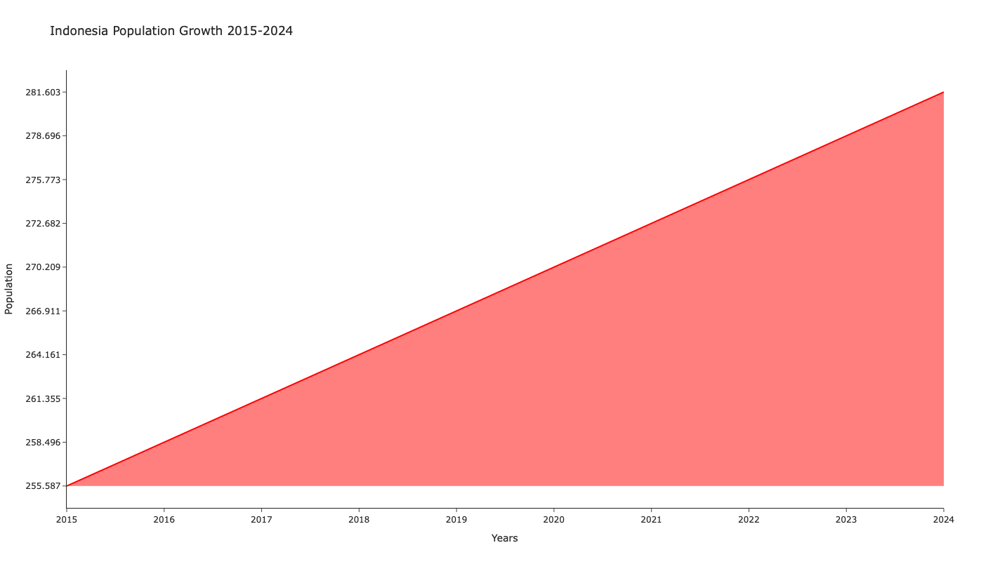

# DEMOGRAPHY & POPULATION IN INDONESIA 
This statistical data simulation analysis or demo data on population and demographics in Indonesia aims to study the quantity and distribution of society. Data collection from [Worldometer](https://www.worldometers.info/world-population/indonesia-population/) with direct data, but my project only makes visual innovation of data.

## Population Largest Cities in Indonesia 
### Create Data Base 
```py
import pandas as pd
import csv

# import data from csv 
datapopulation = pd.read_csv("/Users/mymac/Desktop/Data Github/datapopulation.csv", delimiter=';', header = None) # adjust columns and rows
datapopulation.columns = ['Cities', 'Population'] create columns
datapopulation = datapopulation.iloc[1:]
```
### Result Data Population Indonesia 2024
```py
print(datapopulation)
             Cities Population
1           Jakarta  8,540,121
2          Surabaya  2,874,314
3            Bekasi  2,564,940
4           Bandung  2,444,160
5             Medan  2,435,252
6             Depok  2,056,400
7         Tangerang  1,911,914
8         Palembang  1,668,848
9          Semarang  1,653,524
10         Makassar  1,423,877
11  South Tangerang  1,365,688
12           Jepara  1,257,912
13   Bandar Lampung  1,166,066
14            Batam  1,164,352
15            Bogor  1,099,422
16        Pekanbaru  1,085,000
17           Padang     90,904
18           Malang     84,381
19        Samarinda     83,146
20         Denpasar    725,314
21       Balikpapan    695,287
22           Serang    692,101
23        Situbondo    685,967
24        Pontianak    658,685
25      Banjarmasin    657,663
26       Jambi City      6,062
27           Cimahi      5,684
28        Surakarta    522,364
29           Manado    451,916
30           Kupang    442,758

```
### Retrieving Indonesia Coordinate Data 
```py
import geopandas as gpd

# download data from natural data earth site
world = gpd.read_file("/Users/mymac/Desktop/Data Github/ne_110m_admin_0_countries.shp")
world = gpd.read_file("/Users/mymac/Desktop/Data Github/ne_110m_admin_0_countries.dbf")
world = gpd.read_file("/Users/mymac/Desktop/Data Github/ne_110m_admin_0_countries.shx")

# filter data to Indonesia geo
Indonesia = world[world['SOVEREIGNT'] == 'Indonesia'] 

#indonesia geometry centroid data 
Indonesia_centroid = indonesia.geometry.centroid
latitude = Indonesia_centroid.y.values[0]
longitude = Indonesia_centroid.x.values[0]

# coordinate indonesia
print("Latitude:", latitude)
Latitude: -2.221737936520542

print("Longitude:", longitude)
Longitude: 117.42340756227364
```

### Retrieving Indonesia Cities Coordinate Data
```py
import geopandas as gpd

citiesidn = gpd.read_file("/Users/mymac/Desktop/Data Github/ne_10m_populated_places_simple.shp")
citiesidn['Latitude'] = cities.geometry.y
citiesidn['Longitude'] = cities.geometry.x
cities_df = cities[['NAME(cities)', 'Latitude', 'Longitude']]

print(cities_df)
  No Cities    Latitude  Longitude 
   <dbl> <chr>     <chr>     <chr>     
      1 Jakarta   -6.175247 106.827049
      2 Surabaya  -7.245972 112.737827
      3 Bekasi    -6.234986 106.994544
      4 Bandung   -6.921553 107.611021
      5 Medan     3.589665  98.673826 
      6 Depok     -6.407190 106.815837
      7 Tangerang -6.176192 106.638216
      8 Palembang -2.988824 104.756851
      9 Semarang  -6.990399 110.422910
     10 Makassar  -5.134296 119.412428
# ℹ 20 more rows
# Combine data population with data longitude and latitude
# Data cities population and Latitude,Longitude

datapopulation = {
    'Cities': ['Jakarta', 'Surabaya', 'Bekasi', 'Bandung', 'Medan', 'Depok', 'Tangerang', 'Palembang', 'Semarang',
               'Makassar', 'South Tangerang', 'Jepara', 'Bandar Lampung', 'Batam', 'Bogor', 'Pekanbaru', 'Padang',
               'Malang', 'Samarinda', 'Denpasar', 'Balikpapan', 'Serang', 'Situbondo', 'Pontianak', 'Banjarmasin',
               'Jambi City', 'Cimahi', 'Surakarta', 'Manado', 'Kupang'],
    'Latitude': [-6.175247, -7.245972, -6.234986, -6.921553, 3.589665, -6.407190, -6.176192, -2.988824, -6.990399,
                 -5.134296, -6.322702, -6.589915, -5.446071, 1.103082, -6.596299, 0.526246, -0.924759, -7.977131,
                 -0.501780, -8.652497, -1.239871, -6.105497, -7.706784, -0.022690, -3.324740, -0.037687, -6.873153,
                 -7.569249, 1.490058, -10.163221],
    'Longitude': [106.827049, 112.737827, 106.994544, 107.611021, 98.673826, 106.815837, 106.638216, 104.756851,
                  110.422910, 119.412428, 106.708574, 110.667299, 105.264374, 104.038370, 106.797242, 101.451573,
                  100.363256, 112.634027, 117.139309, 115.216667, 116.859338, 105.988471, 114.005414, 109.344749,
                  114.597505, 109.314475, 107.542310, 110.828448, 124.840871, 123.601776],
    'Population': [8540121, 2874314, 2564940, 2444160, 2435252, 2056400, 1911914, 1668848, 1653524, 1423877,
                   1365688, 1257912, 1166066, 1164352, 1099422, 1085000, 909040, 843810, 831460, 725314, 695287,
                   692101, 685967, 658685, 657663, 606200, 568400, 522364, 451916, 442758]
}

cities_df = pd.DataFrame(datapopulation)

```


### Indonesia Cities Population in 2024
```py
import matplotlib.pyplot as plt
import numpy as np

fig, ax = plt.subplots(figsize=(50, 30))  # size 

# Plot  Indonesia
Indonesia.plot(ax=ax, color='#a6cee3', edgecolor='black')

#  colormap
cmap = plt.colormaps['plasma']

# normalization data population
norm = plt.Normalize(vmin=gdf_cities['Population'].min(), vmax=gdf_cities['Population'].max())

# plot for city with deffent such as population
gdf_cities.plot(ax=ax, color=cmap(norm(gdf_cities['Population'])),
                marker='o', markersize=gdf_cities['Population'] / 100000, 
                label='Population', alpha=0.7)

# add colorbar for showing skala population
sm = plt.cm.ScalarMappable(cmap=cmap, norm=norm)
sm.set_array([])
cbar = fig.colorbar(sm, ax=ax, orientation='horizontal', fraction=0.03, pad=0.04)
cbar.set_label('Population')

# add title
plt.title("Population of Major Cities in Indonesia", fontsize=20)

#legenda delete text label city and just show legend
plt.legend(['City Population'], loc='lower left')

# show map
plt.show()

```


### Cities Population Indonesia 
Distribution of Cities by Population: Notice how cities with higher populations (indicated by larger dots and lighter colors) are spread across Indonesia. Based on the map, large cities with high populations are generally located in Java, Sumatra, and Sulawesi. Concentration in Java: It appears that many cities with large populations are located in Java (such as Jakarta, Surabaya, and Bandung). This indicates a concentration of population on this island.

## [The Population Census in Indonesia](https://www.bps.go.id/en/statistics-table/2/MTk3NSMy/jumlah-penduduk-pertengahan-tahun--ribu-jiwa-.html)
This section makes a basic analysis to display the population census in Indonesia from 2016 to 2024, data collection from the Central Statistics Agency of Indonesia.

### Data Base 
```py
import pandas as pd
import csv 

# import dataset 
datapopulationcensus = pd.read_csv("/Users/mymac/Desktop/Data Github/datapopulationcensus.csv", delimiter=';', header = None)
datapopulationcensus = datapopulationcensus.iloc[1:]
datapopulationcensus.columns = ['Years', 'Census']
print(datapopulationcensus)

 Years   Census
1   2015  255.587
2   2016  258.496
3   2017  261.355
4   2018  264.161
5   2019  266.911
6   2020  270.209
7   2021  272.682
8   2022  275.773
9   2023  278.696
10  2024  281.603

# if create data frame
datapopulationcensus = pd.Data.Frame({
  'Year': [2015,2016,2017,2018,2019,2020,2021,2022,2023,2024],
  'Census':[255.587,258.496,261.355,264.161,266.911,270.209,272.682,275.773,278.696,281.603]
})
```
### Population Growth 2015-2024
```py
## if want create line visual basic graph
import pandas as pd
import matplotlib.pyplot as plt

plt.figure(figsize=(10, 6))
plt.plot(datapopulationcensus['Years'], datapopulationcensus['Census'],
color ='b', linewidth=2)

plt.fill_between(datapopulationcensus['Years'], datapopulationcensus['Census'],
color ='blue', alpha = 0.1)

plt.title('Population Growth 2015-2024')
plt.xlabel('Year')
plt.ylabel('Population')
plt.show()


# visual from plotly.graph
import plotly.graph_objects as go

fig = go.Figure()
fig.add_trace(go.Scatter(
  x=datapopulationcensus['Years'],
  y=datapopulationcensus['Census'],
  mode='lines',
  line=dict(color='red'),
  fill = 'tozeroy',
  name ='Population Growth'))

fig.update_layout(title="Indonesia Population Growth 2015-2024",
xaxis_title="Years",
yaxis_title="Population",
template="simple_white")

fig.show()

```


### Indonesia Population Growth
The population of Indonesia from 2015 to 2024 continues to increase, with a stable growth trend. The government needs to prepare policies to accommodate growth, especially those that impact people's welfare.

## Indonesia Population Projection 2020-2100
This section also makes an analysis of the population projection of Indonesia from 2020 to 2100, data collection form [Country Meters](https://countrymeters.info/en/Indonesia) Purpose of Population Projections Population projections in the field of demography are estimates of the population in the future.
### Data Base
```py
import pandas as pd
import csv

# import data 
populationprojection = pd.read_csv("/Users/mymac/Desktop/Data Github/populationprojection.csv", delimiter=';', header = None)

populationprojection = populationprojection.iloc[1:]
populationprojection.columns = ["Years", "Population"]

populationprojection = pd.DataFrame({
    'Years': [2020, 2025, 2030, 2035, 2040, 2045, 2050, 2055, 2060, 2065, 
              2070, 2075, 2080, 2085, 2090, 2095, 2100],
    'Population': [272222982, 284751033, 295595241, 304758617, 312134190, 
                   317731990, 321550683, 323790913, 324704160, 324574724, 
                   323652781, 322033596, 319781249, 316961616, 313660545, 
                   309025670, 306025531]
})

print(populationprojection)
 Years  Population
0    2020   272222982
1    2025   284751033
2    2030   295595241
3    2035   304758617
4    2040   312134190
5    2045   317731990
6    2050   321550683
7    2055   323790913
8    2060   324704160
9    2065   324574724
10   2070   323652781
11   2075   322033596
12   2080   319781249
13   2085   316961616
14   2090   313660545
15   2095   309025670
16   2100   306025531

```
## Population Projection Indonesia 2020-2100
```py

# Creaate visual basic graph

import pandas as pd
import matplotlib.pyplot as plt

plt.figure(figsize=(10, 6))
plt.plot(populationprojection['Years'],populationprojection['Population'],
color= 'b', linewidth=2)

plt.fill_between(populationprojection['Years'],populationprojection['Population'],
color = 'blue', alpha =0.1)
plt.title("Population Projection 2020-2100")
plt.xlabel('Year')
plt.ylabel('Population')
plt.show()

import pandas as pd
import plotly.graph_objects as go

# graph with plotly
fig = go.Figure()
fig.add_trace(go.Scatter(
    x=populationprojection['Years'],
    y=populationprojection['Population'],
    mode='lines',  # Garis dan titik data
    line=dict(color='red'),
    fill='tozeroy',  # Mengisi area di bawah garis
    name='Population Growth'
))

# setting layout
fig.update_layout(
    title="Indonesia Population Projection 2020-2100",
    xaxis_title="Years",
    yaxis_title="Population",
    template="simple_white"
)

fig.update_xaxes(
  tickmode='linear',
  dtick=5
)
# show graph
fig.show()

```

